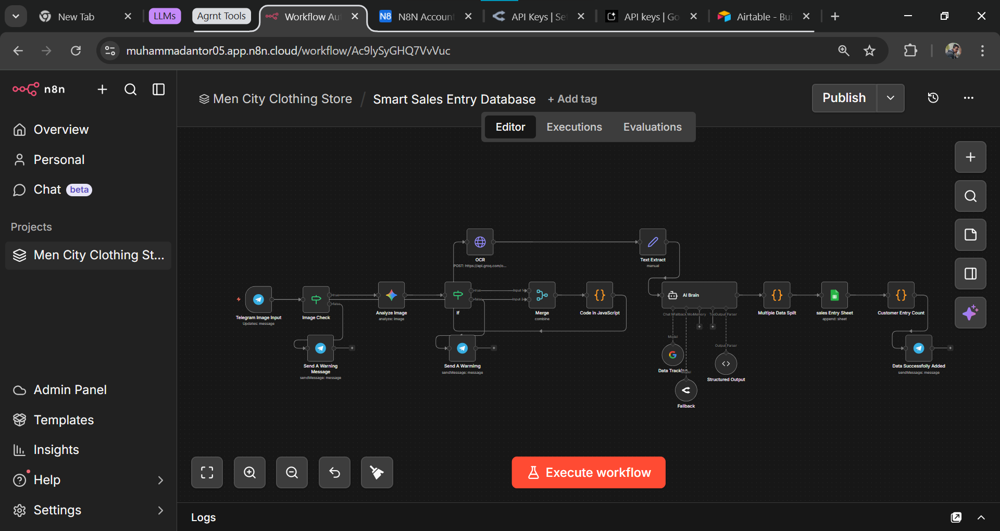

<div align="center">

<!-- BANNER -->


<br/>

<!-- BADGES -->
[](https://n8n.io)
[](https://telegram.org)
[](https://sheets.google.com)
[](https://deepmind.google/gemini)
[](https://groq.com)

<br/>

[]()
[]()
[]()
[]()
[]()

<br/>

> ### 📸 ছবি তোলো → Telegram-এ পাঠাও → Google Sheets-এ data ready
> *No typing. No errors. No delays.*

<br/>

**[🎬 Demo Video](#-demo) • [⚡ How It Works](#-how-it-works) • [🛠 Tech Stack](#-tech-stack) • [📊 Business Impact](#-business-impact)**

</div>

---

## 📌 Table of Contents

- [🎬 Demo](#-demo)
- [🔷 Overview](#-overview)
- [❌ The Problem](#-the-problem)
- [⚡ How It Works](#-how-it-works)
- [🏗 System Architecture](#-system-architecture)
- [🧠 Three-Layer AI Pipeline](#-three-layer-ai-pipeline)
- [🛠 Tech Stack](#-tech-stack)
- [✨ Key Features](#-key-features)
- [📊 Business Impact](#-business-impact)
- [📁 Data Flow Example](#-data-flow-example)
- [⚠️ Challenges & Solutions](#️-challenges--solutions)
- [🔧 Setup & Requirements](#-setup--requirements)
- [📸 Screenshots](#-screenshots)
- [🚧 Limitations](#-limitations)
- [👤 Author](#-author)

---

## 🎬 Demo

<div align="center">

[](https://www.facebook.com/share/v/1BRBfz7YcG/)

> 📹 **Full demo video on Facebook** — Watch the complete system in action:<br/>
> Handwritten memo photo → Telegram Bot → 3-Layer AI Processing → Google Sheets in ~15 seconds

</div>

---

## 🔷 Overview

**MenCity Smart Sales Entry System** হলো একটি **end-to-end AI automation** যা একটি clothing shop-এর daily handwritten sales memo-কে automatically digital database-এ convert করে।

সম্পূর্ণ process Telegram bot-এর মাধ্যমে পরিচালিত হয় এবং Google Sheets-এ real-time data entry হয় — **কোনো manual typing ছাড়াই।**

```
📸 Photo → 📲 Telegram Bot → 🤖 3-Layer AI → 📊 Google Sheets
```

এই system-টি **3টি ভিন্ন AI model** একসাথে ব্যবহার করে:
- প্রথমটি image validate করে
- দ্বিতীয়টি handwriting পড়ে
- তৃতীয়টি data structure করে

---

## ❌ The Problem

একটি traditional clothing shop-এ প্রতিদিন **১০ থেকে ৩০+** sales entry হয় — সব handwritten notebook-এ।

| 😩 Old Way | ✅ New Way |
|:---:|:---:|
| Manual typing — ১৫-৩০ minutes | ১টি photo — done in 15 seconds |
| Human error inevitable | AI validation — zero tolerance |
| Paper record only | Real-time Google Sheets |
| Analytics impossible | Instant business insights |
| End-of-day rush | Live data throughout the day |

---

## ⚡ How It Works

```
 STEP 1                STEP 2               STEP 3              STEP 4
┌─────────┐          ┌──────────┐         ┌──────────┐        ┌──────────┐
│  📸     │          │  🤖      │         │  👁️      │        │  📊      │
│  Photo  │  ──────► │ Telegram │ ──────► │  3x AI   │──────► │ Google   │
│  Memo   │          │   Bot    │         │ Pipeline │        │  Sheets  │
└─────────┘          └──────────┘         └──────────┘        └──────────┘
Shop owner           Receives &           Validates,          Each sale =
photographs          forwards             reads, parses       1 new row ✅
daily memo           the image            handwriting
```

**User experience কেমন:**
1. 📸 দোকানদার sales memo-র ছবি তোলেন
2. 📲 Telegram bot-এ ছবিটি send করেন
3. ⏳ ১৫ সেকেন্ড অপেক্ষা করেন
4. ✅ Bot reply করে: *"Data Successfully Added — 12 Customers"*
5. 📊 Google Sheets-এ সব data automatically populate হয়ে যায়

---

## 🏗 System Architecture

```
┌─────────────────────────────────────────────────────────────────┐
│                    n8n WORKFLOW (19 NODES)                       │
│                                                                   │
│  📲 Telegram Image Input                                         │
│         │                                                         │
│         ▼                                                         │
│  ┌─────────────────┐                                             │
│  │ [1] MIME Check  │ ──── ❌ FALSE → "শুধু মেমো ইমেজ পাঠান"    │
│  └────────┬────────┘                                             │
│           │ TRUE                                                  │
│           ▼                                                       │
│  ┌──────────────────────────────┐                                │
│  │ [2] Gemini 2.5 Flash         │ ── ❌ FALSE → "সঠিক মেমো নয়" │
│  │     Image Validator          │                                 │
│  └──────────────┬───────────────┘                                │
│                 │ TRUE                                            │
│                 ▼                                                 │
│  ┌─────────────────────────────┐                                 │
│  │ [3] Merge Node              │                                 │
│  │     (binary + validation)   │                                 │
│  └──────────────┬──────────────┘                                 │
│                 ▼                                                 │
│  ┌─────────────────────────────┐                                 │
│  │ [4] Code Node               │                                 │
│  │     (image → base64)        │                                 │
│  └──────────────┬──────────────┘                                 │
│                 ▼                                                 │
│  ┌─────────────────────────────┐                                 │
│  │ [5] Groq Llama-4-Scout      │                                 │
│  │     OCR + Table Extraction  │                                 │
│  └──────────────┬──────────────┘                                 │
│                 ▼                                                 │
│  ┌─────────────────────────────┐                                 │
│  │ [6] Text Extract (Set Node) │                                 │
│  └──────────────┬──────────────┘                                 │
│                 ▼                                                 │
│  ┌─────────────────────────────┐                                 │
│  │ [7] AI Brain Agent          │                                 │
│  │     (JSON Parser)           │                                 │
│  └──────────────┬──────────────┘                                 │
│                 ▼                                                 │
│  ┌─────────────────────────────┐                                 │
│  │ [8] Multiple Data Split     │                                 │
│  │     (individual rows)       │                                 │
│  └──────────────┬──────────────┘                                 │
│                 ▼                                                 │
│  ┌─────────────────────────────┐                                 │
│  │ [9] Google Sheets Append    │                                 │
│  └──────────────┬──────────────┘                                 │
│                 ▼                                                 │
│  ┌─────────────────────────────┐                                 │
│  │ [10] Count & Confirm        │                                 │
│  └──────────────┬──────────────┘                                 │
│                 ▼                                                 │
│  ✅ Telegram: "X Customers Added Successfully"                   │
└─────────────────────────────────────────────────────────────────┘
```

---

## 🧠 Three-Layer AI Pipeline

প্রতিটি image process-এ **৩টি আলাদা AI call** হয়:

### Layer 1 — 🛡️ Image Validation
**Model:** Gemini 2.5 Flash

Image valid sales memo কিনা verify করে। System এখানে **extremely strict** — একটি row-ও unclear হলে reject করে। শুধুমাত্র 100% readable images system-এ ঢোকে।

```
Input: Raw image
Output: ✅ VALID or ❌ REJECT + reason
```

### Layer 2 — 👁️ OCR + Table Extraction
**Model:** Groq Llama-4-Scout-17B (Vision)

Handwritten table থেকে structured pipe-separated text extract করে।
- 4 columns independently পড়ে: `Name | Buy | Sell | Profit`
- Bengali digits → English automatically convert
- Cost section ও customer rows আলাদাভাবে label করে

```
Input: Base64 image
Output: Pipe-separated structured text
```

### Layer 3 — 🧠 JSON Parsing
**Model:** AI Brain Agent (LLM)

OCR text → final structured JSON convert করে।

```json
{
  "Customers": [
    {"Date": "2026-04-12", "Details": "Polo", "Buy": 350, "Sell": 500, "Profit": 150},
    {"Date": "2026-04-12", "Details": "পান্জাবি", "Buy": 700, "Sell": 890, "Profit": 190},
    {"Date": "2026-04-12", "Details": "T-Shirt", "Buy": 0, "Sell": 600, "Profit": 0}
  ],
  "Cost": "kaka 300, light 700"
}
```

---

## 🛠 Tech Stack

<div align="center">

| Layer | Technology | Purpose |
|:---:|:---:|:---:|
| ⚙️ **Workflow Engine** | n8n | Full automation orchestration |
| 📲 **Interface** | Telegram Bot API | User input & output delivery |
| 🛡️ **Validator** | Gemini 2.5 Flash | Memo authenticity check |
| 👁️ **OCR** | Groq Llama-4-Scout-17B | Handwriting → text extraction |
| 🧠 **Parser** | AI Brain Agent (LLM) | OCR text → structured JSON |
| 📊 **Database** | Google Sheets API | Final data storage |
| 🔄 **Fallback** | OpenRouter | AI Brain backup LLM |

</div>

<br/>

<div align="center">


</div>

---

## ✨ Key Features

<table>
<tr>
<td width="50%">

### 🎯 100% Data Accuracy Policy
System design-এর মূল principle হলো **zero data loss**। যদি image-এর একটিও row unclear থাকে, system সম্পূর্ণ reject করে এবং পুনরায় photo তুলতে বলে।

> Partial data entry-র চেয়ে reject করা বেশি safe।

</td>
<td width="50%">

### 🔍 Smart Noise Filtering
Notebook-এর printed branding, calendar dates, grand total rows, category subtotals, circled balance numbers — সবকিছু **automatically ignore** হয়। শুধু actual sales data extract হয়।

</td>
</tr>
<tr>
<td>

### 🌐 Multilingual Support
Details column **Bengali ও English** উভয় ভাষায় accept করে। Bengali numbers automatically English-এ convert হয়।

</td>
<td>

### 📉 Negative Profit Handling
Buy > Sell হলে (loss), Profit negative রাখা হয়। System কোনো calculation করে না — **image-এ যা লেখা, হুবহু সেটাই।**

</td>
</tr>
<tr>
<td>

### 🛡️ Robust Error Handling
Empty fields-এ null বা empty string কখনো যায় না।
- Details → `"Unknown Item"`
- Buy/Sell/Profit → `0`
- Cost → `"No Cost"`

</td>
<td>

### ⚡ 15-Second Processing
তিনটি AI call সত্ত্বেও পুরো pipeline মাত্র **~১৫ সেকেন্ডে** complete হয়। Telegram-এ instant confirmation আসে।

</td>
</tr>
</table>

---

## 📊 Business Impact

<div align="center">

| Metric | Before | After |
|:---:|:---:|:---:|
| ⏱️ **Data Entry Time** | ১৫–৩০ minutes | ~১৫ seconds |
| 📝 **Process** | Manual typing | 1 photo |
| ❌ **Error Rate** | Human errors সম্ভব | AI validation — zero tolerance |
| 📁 **Record Type** | Paper only | Real-time digital database |
| 📈 **Analytics** | Manual, difficult | Google Sheets instant analysis |
| 🔄 **Daily Entries** | ৩০+ manual inputs | ১টি photo → all done |

</div>

---

## 📁 Data Flow Example

**Input — Telegram থেকে একটি handwritten memo photo:**

```
[Handwritten memo image]
Name      | Buy  | Sell | Profit
Polo      | 350  | 500  | 150
পান্জাবি | 700  | 890  | 190
T-Shirt   |      | 600  |
---
Cost: kaka 300, light 700
```

**Output — Google Sheets-এ auto-populated rows:**

| Date | Details | Buy | Sell | Profit | Cost |
|------|---------|-----|------|--------|------|
| 2026-04-12 | Polo | 350 | 500 | 150 | kaka 300, light 700 |
| 2026-04-12 | পান্জাবি | 700 | 890 | 190 | kaka 300, light 700 |
| 2026-04-12 | T-Shirt | 0 | 600 | 0 | kaka 300, light 700 |

**Telegram Confirmation:**
```
✅ Data Successfully Added — 3 Customers
```

---

## ⚠️ Challenges & Solutions

<details>
<summary><b>🔴 Challenge 1 — OCR Column Confusion</b></summary>

**Problem:** সব numbers Sell column-এ যাচ্ছিল। Buy ও Profit খালি থাকছিল। Vision model spatial column position বুঝতে পারছিল না।

**Solution:** OCR prompt-এ explicit column position instruction দেওয়া হয়েছে:
> *"Column 1 (far left) = Name, Column 2 = Buy, Column 3 = Sell, Column 4 = Profit"*

</details>

<details>
<summary><b>🔴 Challenge 2 — Cost Entries as Customers</b></summary>

**Problem:** Cost section-এর names (kaka, light, masum) customer row হিসেবে ঢুকছিল।

**Solution:** OCR output-এ `COST:` label দিয়ে আলাদা section করা হয়েছে। AI Brain-এ strict rule — COST section থেকে কোনো customer object তৈরি হবে না।

</details>

<details>
<summary><b>🔴 Challenge 3 — n8n JSON Body Invalid Error</b></summary>

**Problem:** Multiline system prompt সরাসরি HTTP Request node-এর JSON body-তে দেওয়া যাচ্ছিল না।

**Solution:** OCR node-এর আগে একটি Code node বসিয়ে JavaScript দিয়ে পুরো request body build করা হয়েছে। HTTP Request node শুধু `={{ $json.ocrBody }}` reference করে।

</details>

<details>
<summary><b>🔴 Challenge 4 — Notebook Printed Text Contamination</b></summary>

**Problem:** Calendar dates, grand totals, circled balance numbers, category subtotals data-তে ঢুকছিল।

**Solution:** `FILTER_RULE`-এ ৭ ধরনের ignore pattern explicitly define করা হয়েছে।

</details>

---

## 🔧 Setup & Requirements

### Prerequisites
- ✅ [n8n](https://n8n.io) instance (self-hosted or cloud)
- ✅ Telegram Bot Token ([BotFather](https://t.me/BotFather))
- ✅ Google Sheets API credentials
- ✅ [Gemini API Key](https://aistudio.google.com) (free tier available)
- ✅ [Groq API Key](https://console.groq.com) (free tier available)
- ✅ OpenRouter API Key (optional — fallback)

### Quick Setup

```bash
# 1. Clone this repository
git clone https://github.com/muhammadantor/mencity-smart-sales

# 2. Import the n8n workflow
# Go to n8n → Workflows → Import → select workflow.json

# 3. Configure credentials in n8n:
#    - Telegram Bot API
#    - Google Sheets OAuth2
#    - Gemini API (HTTP Header Auth)
#    - Groq API (HTTP Header Auth)

# 4. Set your Google Sheet ID in the Sheets node

# 5. Activate the workflow ✅
```

### Google Sheets Column Setup

Your target sheet must have these exact headers:

| A | B | C | D | E | F |
|---|---|---|---|---|---|
| Date | Details | Buy | Sell | Profit | Cost |

---

## 📸 Screenshots

<div align="center">

### ⚙️ n8n Workflow — Full Pipeline



> Complete 19-node automation pipeline — from Telegram input to Google Sheets output

</div>

---

## 🚧 Limitations

- 📷 **Image quality must be high** — blurry photos are rejected by design
- 📋 **Works best with consistent 4-column memo format**
- ⚡ **Groq free tier has rate limits** — heavy usage may hit 429 errors
- 🌐 **Requires internet** for all three AI API calls
- 🗓️ **Date must be visible** in the memo or manually set

---

## 💡 Future Improvements

- [ ] 📊 Auto-generate daily/weekly profit reports
- [ ] 🔔 Low stock alerts based on sell patterns
- [ ] 📱 WhatsApp Business API support
- [ ] 🗣️ Voice memo input support
- [ ] 📈 Built-in analytics dashboard

---

## 👤 Author

<div align="center">


### Muhammad Antor
**AI Automation Engineer | AutomateIQ Labs ⚡**

*Building smart systems that work while you sleep*

[](https://linkedin.com/in/muhammadantor)
[](https://t.me/muhammadantor)
[](mailto:muhammadantor71@gmail.com)
[](https://facebook.com/automateiqlab)

</div>

---

<div align="center">

**⭐ If this project helped you, please give it a star!**

*Built with ❤️ using n8n · Gemini · Groq · Telegram · Google Sheets*


</div>
